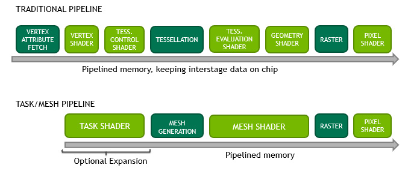

\renewenvironment{Shaded} {\begin{snugshade}\footnotesize} {\end{snugshade}}

# Introduction

Over time the graphics pipeline has gotten more and more complicated. While some parts of the currect graphics pipeline are flexible (geometry shaders, tesselation) they are not performant and where the graphics pipeline is performant it is often not flexible (instancing).



Mesh shaders aim to simplyify the graphics pipeline by removing the input assambler, replacing the tesslator with a mesh generator, replacing the vertex shader and tesselation control shader with a (optional) *task shader* (Called *amplification shader* in DirectX 12). and the tesselation evaluation shader and geometry shader with a mesh shader. This simplification has the effect of introducing higher scalability and bandwidth-reduction.

> TODO: Explain why mesh shading is more scalable and can reduces bandwidth.

The mesh and task shaders are basically compute shaders. This gives developers the freedom to use threads for different purposes and share data among them using *wave intrinsics*[@dx:wi]/*subgroups*[@vk:subgroups].

## The Mesh Shader

As aforementioned the mesh shader is similar to compute shaders. Like compute shaders, a mesh shader defines a work group of parallel-running threads (lanes). In DirectX 12 you can define it as a 3 dimensional block which cannot exceed $X \times Y \times Z = 128$. In Vulkan however you are limited to the x component with a maximum value of $32$. See @lst:threads. You will also need to define the output topology for the mesh shader. The only option you have at the time of writing this paper is for Vulkan `triangles` and for DirectX12 `triangles` and `line`. See @lst:outprim.

```{#lst:threads .glsl caption="Defining the work group size"}
// Vulkan
layout(local_size_x=32) in;
// DirectX 12
[numthreads(32, 32, 32)]
```

```{#lst:outprim .glsl caption="Defining the output topology"}
// Vulkan
layout(triangles) out;
// DirectX 12
[outputtopology("triangle")]
```

Unlike DirectX12, Vulkan requires you to define the maximum amount of vertices and primitives (both cannot exceed 256) per meshlet. These settings can affect performance drastically even if you do not reach the max specified by the user. See @lst:layoutmax.

```{#lst:layoutmax .glsl caption="Specifiying the maximum number of vertices and primitives"}
layout(
	max_vertices=VERTEX_COUNT,
	max_primitives=PRIMITIVE_COUNT
) out;
```

Some where in your mesh shader you need to set the meshlet primtive count. In Vulkan you use the build-in variable `gl_PrimitiveCountNV` and in DirectX 12 you can call `SetMeshOutputCounts(numVertices, numPrimitives)`. As you can see in the function definition the DirectX12 function allows you to set the number of vertices dynamically unlike Vulkan which uses the static `layout[]` as seen in @lst:layoutmax.

Outputting the indices in Vulkan is done with the build-in variable `gl_PrimitiveIndicesNV[]` or the function `writePackedPrimitiveIndices4x8NV` which writes 4 indicies from a 32 bit value. In DirectX12 you specifiy in the shader entry parameters a out parameter called `indices`. See @lst:writeindices

```{#lst:writeindices .glsl caption="Outputting indices"}
// Vulkan
void main()
{
	gl_PrimitiveIndicesNV[i] = index;

	gl_PrimitiveCountNV = prim_max;
}

// DirectX 12
void main(
    // ..
	out indices uint3 triangles[128])
{
	triangles = uint3(i0, i1, i2);
	
	SetMeshOutputCounts(
		num_vertices,
		num_primitives);
}
```

For the vertex positions Vulkan exposes the `gl_MeshPerVertexNV` object whith a couple of variables on of which is `gl_Position`. DirectX 12 has  a shader entry parameter for this just like the indices but with the `SV_Position` intrinsic instead.

```{#lst:writevertices .glsl caption="Outputting vertex positions"}
// Vulkan
void main()
{
	gl_PrimitiveIndicesNV[i] = index;
	gl_MeshVerticesNV[i].gl_Position 
		= float4(x, y, z, w);

	gl_PrimitiveCountNV = prim_max;
}

// DirectX 12
void main(
    // ..
	out vertices float4 : SV_Position verts[256],
	out indices uint3 triangles[128])
{
	triangles[i] = uint3(i0, i1, i2);
	verts[i] = float4(x, y, z, w);
	
	SetMeshOutputCounts(
		num_vertices,
		num_primitives);
}
```

Passing other attributes to the fragment/pixel shader can be done in Vulkan and DirectX12 the same way as done in vertex shaders. for Vulkan this is the `layout(location = 0) out` system and for DirectX12 is changing the output vertices type to a struct with the correct semantic for the position and the `ATTRIBUTE` semantic for the other attributes. See @lst:vertattribs.

```{#lst:vertattribs .glsl caption="Outputting extra attributes"}
// Vulkan
layout(location = 0) out vec2 uv[];

void main()
{
	uv[i] = vec2(u, v);
}

// DirectX 12
struct Vertex
{
	float4 pos : SV_Position;
	float2 uv : ATTRIBUTE;
};

void main(
    // ..
	out vertices Vertex verts[256])
{
	verts[i].pos = float4(x, y, z, w);
	verts[i].uv = float2(u, v);
}
```

## The Task Shader

## Executing Mesh Shaders

Both Vulkan and DirectX 12 allow you to either execute mesh shaders directly or using execute indirect. I'll skip over the indirect version for now. Vulkan has the `vkCmdDrawMeshTasksNV(VkCommandBuffer cmdBuffer, uint32_t taskCount, uint32_t firstTask);` function. `taskCount` is the number of mesh shaders to execute with the group size specified in the shader. The `firstTask` parameter allows you to make sure the order of task shaders and mesh shaders is correct. DirectX 12 has `DispatchMesh(ThreadGroupCountX, ThreadGroupCountY, ThreadGroupCountZ)`. As mentioned before the biggest difference is that DirectX12 allows 3 dimensional thread blocks.

You don't need to bind a vertex buffer the traditional way anymore. Instead you are required to create a descriptor to your buffers and use that to read from the buffer directly in the mesh shader. You could just bind the vertex buffer and index buffer directly without modifying the contents of it but this is not the most efficient approach. For these optimizations see @sec:gen_meshlets.

# Generating Meshlets {#sec:gen_meshlets}

# Rendering Meshlets

> In this section I'll focus on Vulkan and mostly ignore DirectX12. Vulkan's version of wave intrinsics is called *subgroups*. You can read more about them here @vk:subgroups and see how they compare to DirectX12's wave intrinsics @dx:wi.

So first things first. We need to decide on the work group size. I found that using all the threads available in the warp (wavefront) was most efficient (32 in the case of my RTX 2060).

# Instancing

## Benchmarks

# Culling

## Benchmarks

# Tesselation

## Benchmarks

# Raytracing

I had hoped mesh shading would go hand in hand with ray tracing. But this doesn't seem to be the case. Of course mesh shading can still be used to accelerate hybrid raytracing but you can't reuse the meshlet buffers and descriptions in a valuable way for the acceleration structures or obtaining attributes (uv, normals and etc) in the raytracing shaders.

# Concolusion

# Further Work

There are undoubtedly many more optimization and techniques yet to be discovered. Some subjects that require research but not limited to are:

* Using wave intrinsics to share vertex and index data between instances.
* Benchmark how the `SetMeshOutputCounts`'s num vertices affects performance compared to Vulkan's approach.
* Dynamic Level of Detail approaches.
* Procedual geometry.
* Execute-Indirect and mesh shaders.
* My current approach to displacement mapping is very basic. This could undoubtedly be improved drastically.

# References

