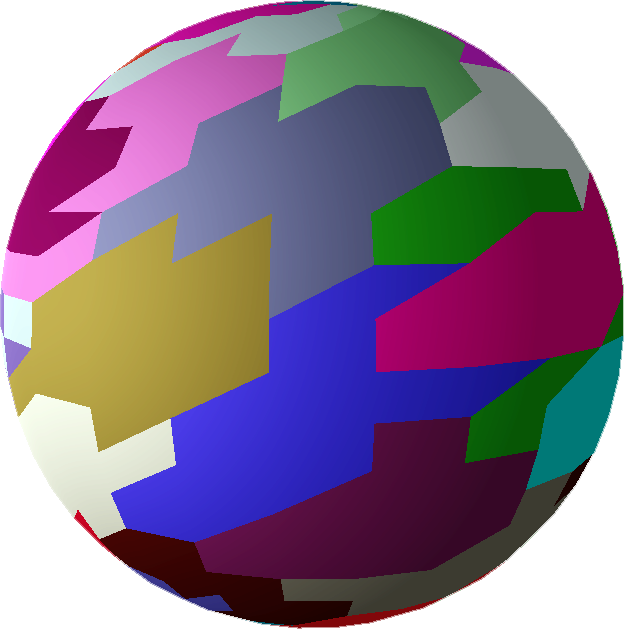

\newcommand\note[1]{\textcolor{red}{\textbf{NOTE: \emph{#1}}}}
\renewenvironment{Shaded} {\begin{snugshade}\footnotesize} {\end{snugshade}}

# Introduction

Over time the graphics pipeline has gotten more and more complicated. While some parts of the current graphics pipeline are flexible (geometry shaders, tessellation), they are not performant and where the graphics pipeline is performant it is often not flexible (instancing).

![Standard vs Mesh Shading Pipeline[@wiki:intromeshshadinag]](images/pipeline.jpg){#fig:pipeline}

Mesh shaders aim to simplify the graphics pipeline by removing the input assembler, replacing the tesselator with a mesh generator, substituting the vertex shader and tessellation control shader with a (optional) *task shader* (Called *amplification shader* in DirectX 12) and the tessellation evaluation shader and geometry shader with a mesh shader. This simplification has the effect of introducing opportunity for higher scalability and bandwidth-reduction.

These changes allow rendering engineers to satisfy the need for the high poly count and high number of objects in modern video games and graphics software like CAD.

## The Mesh Shader {#sec:themeshshader}

The mesh shader (and task shader) are basically compute shaders. A mesh shader begins its work by dispatching a set of thread groups, each of which process a subset of the larger mesh. Similar to compute each thread has access to *groupshared memory*. The output vertices and primitives however do not have to correlate to a specific thread in the group. As long as all vertices and primitives used in the thread group are processed, resources can be allocated in whichever way is most efficient. The user is also capable of specifying per-vertex and per-primitive attributes, which allows for faster and space efficient rendering.

There are currently two implementations of mesh shaders. One in the DirectX12 API[@dx:msspec] and extensions for both OpenGL[@gl:meshext; @glsl:meshext] and Vulkan[@vk:meshext; @glsl:meshext]. There are a couple of differences between these. Vulkan and OpenGL only allow 1 dimensional thread groups. DirectX however allows for 3 dimensional thread groups. DirectX also has the ability to dynamically specify the number of output vertices dynamically unlike Vulkan which only allows you to specify that value statically.

{#fig:meshlets height=15%}

The aforementioned submeshes processed by thread groups are called *meshlets*. The idea is that the programmer algorithmically splits the mesh in $x$ amount of meshlets with a vertex count of 32 to around 200, depending on the number of attributes. It is most efficient to generate meshlets with as many as possible vertices that allow re-use. These meshlets should be pre-computed. This is a big benefit over the old Input Assembler which has to identify vertex re-use dynamically. In [@sec:genmeshlets] I go over how to efficiently pre-compute meshlets.

## The Task Shader {#sec:thetaskshader}

An optional expansion in the mesh shader pipeline is the *task shader* (*amplification shader*). While the mesh shader is a flexible tool, it does not allow for tessellation or efficient culling of entire meshlets.

The most basic use of a task shader is basically executing mesh shaders. We can determine for example whether a meshlet is visible and conditionally execute the mesh shader that is supposed to process the meshlet. Task shaders are capable of sharing data with its child mesh shaders and also the children have access to the parents group shared memory. To give a practical example of mesh shaders, they allow you to add more triangles to the meshlet for displacement mapping since you can exceed the limited vertex count per mesh shader by executing two mesh shaders instead.

## Executing Mesh & Task Shaders {#sec:execmeshshader}

Both Vulkan and DirectX 12 allow you to either execute mesh shaders directly or using execute indirect[dx:indirectdrawing]. Vulkan has the function `CmdDrawMeshTasksNV`[@vk:meshext] with the parameters `uint32_t taskCount` and `uint32_t firstTask`. `firstTask` allows you to specify what mesh shader to execute first. Lets say you have a task shader and a mesh shader but they are placed in the pipeline in the order of mesh shader, task shader but you still want to execute the task shader first. In this case you can set `firstTask` to 1 and it will execute the task shader first followed my the mesh shader. The other parameter - `taskCount` - is a bit misleading. It is actually the amount of thread groups in the `x` dimension you want to execute on the first task shader.

DirectX 12 is a bit more straight forward with its `DispatchMesh`[@dx:msspec] function. It has three parameters defining a 3 dimensional thread group size. Each thread group size component must be less than 64k and the product of $ThreadGroupCountX \times ThreadGroupCountY \times ThreadGroupCountZ$ must not exeed $2^{22}$

In Vulkan to calculate the `numTasks` parameter I use the following formula: $numTasks = (N + S - 1) / S$ where $N$ is the number of meshlets multiplied by the number of instances and $S$ is the size of the thread group. DirectX is a bit more complicated since you could optimize the mesh shader in different ways using the 2 extra dimensions. For example every instance of a meshlet could be a index in the `y` dimension.

Moving on, you don't need to bind a vertex buffer the traditional way anymore. Instead you are required to create a descriptor to your buffers and use that to read from the buffer directly in the mesh shader. You could just bind the vertex buffer and index buffer directly without modifying the contents of it but this is not the most efficient approach. For these optimizations see @sec:genmeshlets.

# Generating Meshlets {#sec:genmeshlets}

To be able to render meshlets you need to know what to render. During model loading we can generate these meshlets. First of all we want to have vertices and indices we can process in the mesh shader. In [@sec:themeshshader] I mentioned we want to optimize the re-use of vertices, so every meshlet should have the highest number of re-use possible. We can build the vertex buffer using the following algorithm:

1. Take the first triangle that hasn't already been added to a meshlet.
1. Loop over all triangles left in the mesh.
	* Find as many duplicate vertices as possible and add their parent triangle to the meshlet (without exceeding the maximum amount of vertices).
	* If there are no duplicates left add any triangle that hasn't been added to a meshlet until the maximum amount of vertices is reached.

Keep in mind that theoretically it is possible to have a vertex re-used more often than the maximum vertex count of a meshlet. Also note that you can't share a single triangle over multiple meshlets.

While assigning vertices to meshlets you can also create the index buffer of the meshlets. Indices can be stored like normal by ranging the indices from 0 to the number of vertices. Or you can flatten the index buffer and in the mesh shader append a "vertex start" variable to the index. The latter allows us to have a 32 bit index buffer where we store 4 indices in 1 value and write with one operation 4 indices to the output of the mesh shader (`writePackedPrimitiveIndices4x8NV`[@glsl:meshext]).

# Rendering Meshlets {#sec:renderingmeshlets}

> In this paper I will only be considering one dimensional thread group sizes. You might be able to do some additional optimization using DirectX 12. Due to the fact that mesh shading has only recently been added to the API there was no time to try this out.

The first thing needed to be able to render meshlets is to decide on the thread group size. I found that using all the threads available in the warp (wavefront) was most efficient (32 in the case of my graphics card).

To generate our primitives in the mesh shader we require some data. For now we only need the number of vertices in the meshlet, the number of primitives in the meshlet, the offset of the meshlet in the vertex buffer and the offset of the meshlet in the index buffer. In my implementation I store the counts in 8 bits and the offsets in 20 bits. This data is our meshlet descriptor. Since we require to read these descriptors from the GPU I try to be bandwidth aware and keep the size of the descriptor down as much as possible. On the GPU we can index into a meshlet descriptor buffer using the following formula: $meshlet\_id = base\_id$ where $base\_id = work\_group\_id_{1} \times work\_group\_id_{2} \times work\_group\_id_{3}$

In the mesh shader you would want to have two loops. One parsing the indices and one parsing the vertices. You could do this in the same loop. But since we likely have duplicate vertices we don't want to parse vertices twice or introduce branching. To get the most out of our hardware we need to split the work over the thread group. We can calculate the number of itterations for the loops respectively with the following two formulas: $prim\_count / group\_size$ and $vert\_count / group\_size$. To allow the shader compiler to compute this during compilation we can use the maximum primitive and vertex count instead of the actual values. This has the additional benefit of reduced branching.

Parsing the vertices should be relatively straight forward. Output the vertex position (multiplied by the MVP if required) and output the other attributes of the vertex (normals, tangents, etc).

Parsing indices is even simpler but instead of just outputting the indices directly we can optimize it by writing 4 or 8 indices in the same loop iteration. If you want to make use of this optimization the formula used to calculate the number of loop iterations becomes $prim\_iterations = prim\_count / group\_size \times indices\_per\_iteration$. You can write 4 indices at the same time by using `writePackedPrimitiveIndices4x8NV` in GLSL. HLSL however does not have such function.

When parsing a meshlet it is important to understand that it doesn't matter what vertices and indices you are parsing per thread. If you parse $x$ index you don't require its corresponding vertex in the same thread. This allows us to parse vertices and indices in any order.

In the vertex and index parsing loops which iterate `i` from 0 to `num iterations` (see [@sec:renderingmeshlets]) we can calculate the index using the following formula: $idx = local\_invocation\_id\_{1} + i * group\_size$. Meaning we loop over a subset of indices and vertices per lane so we don't parse indices or vertices multiple times within the same thread group.

# Instancing

Instancing is a bit more difficult compared to the old vertex pipeline. I have 2 solutions for this problem. One is uses Execute Indirect while the other does the instancing using mesh shaders only. Both techniques still require you to bind a big buffer with all the per-instance data just like with the standard pipeline.

## Instancing Using Execute Indirect

This is a rather simple approach. The mesh shader API provides us with `vkCmdDrawMeshTasksIndirectNV` and works similar to normal indirect execution. And instead of calculating the instance id ourselves we can use the `ARB_shader_draw_parameters`[@glsl:shaderdrawext] extension which provides us with `gl_DrawIDARB`[@glsl:shaderdrawext] which we can functionally use as the instance id.

I believe this technique to be the fastest. While I haven't benchmarked it myself the inherit performance gain from moving CPU work to the GPU provided by indirect execution still remains and it simplifies the instancing code significantly.

## Instancing Using Only Mesh

We need to calculate `gl_InstanceID ` ourselves and instead of increasing the `num instances` parameter of the old `vkCmdDrawIndexed` / `vkCmdDraw` commands we need to multiple the number of meshlets per mesh by the number of instances.

To compute the instance id we can use the following formula: $inst\_id = (base\_id + lane\_id) / num\_meshlets$. Note that we require the number of meshlets of the mesh here. We will need to adjust the meshlet id calculation as well: $meshlet\_id = meshlet\_id \pmod{num\_meshlets}$

# Culling {#sec:culling}

Culling is one of the biggest strengths of mesh shaders. There are two high level types of culling you can do: per-triangle culling from within your mesh shaders or meshlet culling from within task shaders. While per-triangle culling was a already possible with the standard pipeline, meshlet culling is something new and very powerful. It will allow you to discard entire batches of vertices before even parsing them which is something the input assembler was incapable of doing efficiently.

## Meshlet Culling

Task shaders work pretty much exactly the same as mesh shaders. But instead of building meshes we execute mesh shaders. We can specify the amount of mesh shaders we want to execute using `gl_TaskCountNV` or `DispatchMesh`. Data can be send down to mesh shaders using the `taskNV out` or the `DispatchMesh`'s payload.

When using task shaders we can no longer calculate the meshlet id using the base id of the mesh shader since it won't match the base id of the task shader. To fix this we can pass an array of task shader lane ids ($lane\_id = local\_invocation\_id_{1} \times local_invocation\_id_{2} \times local\_invocation\_id_{3}$) down to the mesh shader which we can use from within the mesh shader as a lane id by indexing into the array using the work group id and changing the formula to the following: $base\_id + task\_lane\_id$

We can determine the number of mesh shaders tasks during initialization on the CPU but since we want to cull meshlets we want to calculate this value at runtime. First off lets make sure we don't execute more mesh shaders than we have meshlets. We can do this by checking whether the meshlet id equals or exceeds the max number of meshlets.

```{#lst:optrender .cpp caption="Conditional rendering using task shaders"}
bool render = !(global_id > total_meshlet_count);
uvec4 vote = subgroupBallot(render);
uint num_tasks = subgroupBallotBitCount(vote);
```

In [@lst:optrender] I use wave intrinsics[@dx:wi] (subgroups[@vk:subgroupslides; @vk:subgrouptut]) to compute the number of meshlet tasks we need. I do this instead of a `atomicAdd` because I can repurpose the `vote` variable when passing the lane id down to the meshlet to calculate the meshlet id when using task shaders. As aforementioned in the preamble of [@sec:culling], we need to pass down the lane id of the task shader. Now since we are no longer rendering all meshlets I can't guarantee the array of lane ids is sequential. To fix this we can calculate a offset int the array ourselfs by getting the exclusive bit count of `vote` as seen in [@lst:optrenderout].

```{#lst:optrenderout .cpp caption="Passing the lane id to the mesh shaders"}
uint offset = subgroupBallotExclusiveBitCount(vote);
if (render)
	OUT.sub_ids[offset] = lane_id;
```

### Frustum Culling

For per-meshlet frustum culling we require a bit more information of our meshlets. We will need a bounding box for every meshlet. If we calculate the bounding box relative to the bounding box of the entire mesh we can store it in 6, 8 bit unsigned integerers: 3 minimum and 3 maximum corners. We will also need to access the mesh bounding box and the model view projection matrix.

Truncating the meshlets bounding box to the mesh bounding box can be easily done by subtracting, then dividing the meshlets bounding box corners by the bounding box of the mesh. To fit the bounding box within 6, 8 bit unsigned integers we want to snap the bounding box to a 8 bit grid. This can be done with [@lst:snaptogrid].

```{#lst:snaptogrid .cpp caption="Snap bounding box to 8 bit grid"}
bb_uint8_min.x = 
	clamp(int(truncf(bb_min.x * 255.f)), 0, 255.f - 1);
// Same for the y and z components
bb_uint8_max.x = 
	clamp(int(ceilf(bb_max.x * 255.f)), 0, 255.f);
// Same for the y and z components
```

To actually cull meshlets using this data we want to see if any of the 8 corners of the bounding box are inside of our field of vision. If any of the corners is not visible we render the meshlet. We need to compute all 8 corners from the 6 bounding box values we have and multiply them by the model view projection matrix. The resulting values can be used to determine whether the corners are within our view by checking the screen position as seen in [@lst:cornercheck].

```{#lst:cornercheck .cpp caption="Determine whether a screen position is on screen"}
	bits |= hPos.x < -hPos.w ?  1 : 0;
	bits |= hPos.x >  hPos.w ?  2 : 0;
	bits |= hPos.y < -hPos.w ?  4 : 0;
	bits |= hPos.y >  hPos.w ?  8 : 0;
	bits |= hPos.z <  0      ? 16 : 0;
	bits |= hPos.z >  hPos.w ? 32 : 0;
	bits |= hPos.w <= 0      ? 64 : 0; 
```

If all corners are outside our view the final value of `bits` will be 0, meaning if this is not the case we need to render the meshlet.

### Backface Culling

Per-meshlet backface culling is slightly more complicated since we need to compute an area in the form of a cone (with $\infty$ length) which can tell us in what area only the meshlets backface is visible. We can pre-compute this cone on the CPU. We can compress the angle into 1, 8 bit values. The normal of the cone can be compressed into 2, 8 bit values using a 16 bit unit vector compression algorithm. See the paper "A Survey of Efficient Representations
for Independent Unit Vectors"[@unitvectors] which lists unit vector compression techniques and also contains reference implementations and benchmarks.

Finding the cone's normal is done by getting the average of all vertex normals of the meshlet. The angle can be computed by finding the smallest angle between the average normal and all triangle normals.

### Subpixel Culling

Subpixel culling is a technique where you cull elements of a scene that are so small on the screen that if you cull them it makes a minimal difference in image quality. Generally this technique is mainly used for triangles but we can also apply this to entire meshlets.

For subpixel culling a extra bit of data is required, the viewport. We can use the viewport to obtain the minimum and maximum pixel size of the corners of the meshlet bounding box. It is recommended to apply some safety around the bounding box to take into account fixed point rasterization. The aggressiveness of culling can be increased by multiplying the viewport by a value in the range of $0-1$ where 1 is no culling and 0 will cull everything. The actual cull test can then be done by rounding the pixel min and max and checking whether the x component of the x or y component are the same. If one of them are the same we want to render the pixel.

## Per-Triangle Culling

For culling triangles I recommend keeping your vertex and index loops as they are. We can re-use `gl_PrimitiveIndicesNV` and `gl_MeshVerticesNV` to conditionally render triangles.

To test a triangle we need to make sure all vertices are parsed by all threads in the thread group since we can't guarantee that a thread's indices point to the same vertices the thread parsed. To do this we need to place a memory barrier (`GroupMemoryBarrierWithGroupSync` or `memoryBarrierShared`).

Now to test triangles to determine whether want to render them we need to loop over all the primitives again. You can copy the indices loop code for this. Than you can retrieve the indices of the triangle from `gl_PrimitiveIndicesNV` and the vertex positions from `gl_MeshVerticesNV::gl_Position`.

The actual algorithm to determine visibility of a triangle are out of the scope of this paper. These techniques are very well documented with many code examples online and unlike meshlet culling they are no different from there traditional counterparts. I recommend looking into back-face culling[@wiki:backfaceculling], frustum culling[@wiki:frustumculling] and subpixel culling.

After you have determined whether a triangle should be rendered we need to somehow mark it to be rendered. We can easily increment the `gl_PrimitiveCountNV` variable so we only render the correct amount of triangles but if there is a triangle that doesn't need to be rendered in the middle of the build-in index array we want to make sure we skip that one. To accomplish this we can re-structure the output index buffer. To do this we need to make sure we are not overwriting the indices of other threads. Here wave intrinsics comes in handy again ([@lst:reorder]).

```{#lst:reorder .cpp caption="Reordering the indices based on whether a triangle should be rendered"}
// calculate the 
uvec4 vote = subgroupBallot(render);
uint tris = subgroupBallotBitCount(vote);
uint idx_offset = 
	prim_count + subgroupBallotExclusiveBitCount(vote);

// re-order indices array
if (render)
{
	uint idx = idx_offset * 3;
	gl_PrimitiveIndicesNV[idx + 0] = idx_a;
	gl_PrimitiveIndicesNV[idx + 1] = idx_b;
	gl_PrimitiveIndicesNV[idx + 2] = idx_c;
}

prim_count += tris;
```

# Tessellation

Tessellation is a feature that becomes much easier to implement and optimize with mesh shaders. To simplify, you can look at the task shader in this case as the control shader from the old tessellation pipeline. But unlike the old pipeline it uses a cooperative thread model and instead of having to take a patch as input and tessellation decisions as output, its input and output are user defined.

Mesh shaders have a limited amount of vertices we can produce and since we are subdividing triangles for tessellation we will need to subdivide meshlets into smaller meshlets from our task shader (or pre-computed). Lets say we want to divide every triangle of a meshlet once. This means we need to divide the meshlet into 3 smaller meshlets (Every triangle subdivision will introduce 3 extra vertices using a standard non-smoothing subdivision algorithm). 

The task shader could be extended to subdivide only triangles or meshlets with a specific material. This can be relatively easily implemented by re-purposing a bit of the meshlet id or extending the indices buffer to contain a boolean telling you whether to subdivide or not. The latter however does increase bandwidth and the former reduces precision of some meshlet information.

The actual subdivision should happen in the mesh shader since the vertices and indices are already being parsed here and since you also want to displace the newly generated triangles you also want to be reading from attribute buffers to displace the vertices the right amount and into the right direction.

The technique I propose in this paragraph is one of many of possible solutions to tessellation. The biggest strength in mesh shading lies in its flexibility. For example you are now able to implement custom tessellation patterns.

Tessellation does introduce problems when combining it with meshlet culling. You can't efficiently cull anymore if you don't know how the vertices will be displaced. I recommend expanding the bounding box of the meshlet in all directions by the highest amount of displacement provided provided by a displacement map, material property or a engine-wide limitation.

# Raytracing

Mesh shaders and the raytracing API's acceleration structures don't easily communicate with each other but it might be possible by streaming data to intersection shaders. This could be usefull in the form of tessellation and animation for example. I haven't tried this myself yet and needs further investigation. Of course you will see a performance benefit if the raytracer takes a hybrid approach where the gbuffers are filled using mesh shaders.

## Performance

{#fig:scenea height=15%}

{#fig:scenea height=15%}

\tablefirsthead{\toprule Standard Pipeline&Mesh Shading Pipeline \\ \midrule }
\begin{supertabular}{rr}
    0.26 & 0.36
\tablelasttail{ \\ \bottomrule }
\end{supertabular}
**Hardware:** *RTX 2080 TI*

\note{Benchmarks will be done later. Currently I don't have access to the hardware.}

\newpage

# Conclusion

Mesh shading is not a magic bullet that will automatically make your rendering faster. It takes a lot of time to implement and optimize. And if you end up without any culling or instancing you will see a trivial performance difference. Mesh shading becomes really interesting when you implement meshlet culling and triangle culling (especially meshlet frustum culling has a great impact in performance) and or optimize your shaders for specific scenarios. Another area where mesh shading excels is high poly count meshes. Being able to blackface cull entire subsets of a mesh is very beneficial for performance. No matter what your implementation looks like you will always see a increase in memory usage due to the need to pre-compute meshlets and their descriptors. This technology is still in its infancy and moving forward we will lively see new techniques and applications for mesh shading.

# Further Work

There are undoubtedly many more optimizations and techniques yet to be discovered. Some subjects that require research but not limited to are:

* Using wave intrinsics to share vertex and index data between instances.
* The tessellation technique covered in this paper is very simplistic and only covers the basics. I believe there are many different opportunities for optimization in this area previously impossible.
* Benchmark how the `SetMeshOutputCounts`'s vertex count affects performance compared to Vulkan's approach.
* Update the implementation using Vulkan 1.2's GPU buffer pointers.
* Dynamic Level of Detail approaches.
* Procedural geometry.

# References

